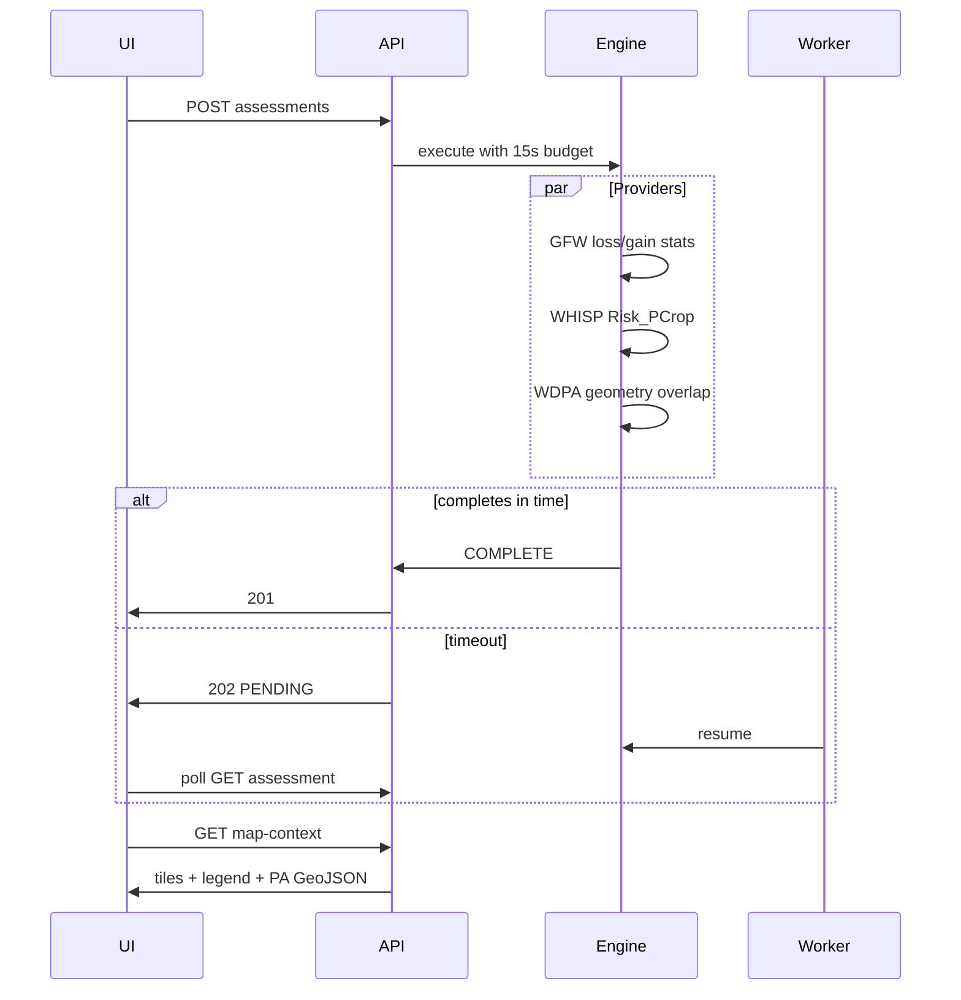

# Deforestation & Farm Assessment — Solution Design

> Status: **implemented** — PostgreSQL-backed boundaries and assessments at `/api/v1/farms/:id/boundary`, `/assessments`, `/assessments/:assessmentId/map-context`, `/land-cover-timeline`, `/geocode`; frontend BFF proxies when `NEXT_PUBLIC_USE_MOCK_API=false`.

## Introduction

Farm boundary persistence, WHISP/GFW/WDPA-backed deforestation assessments, land-cover timelines, assessment map overlays, and supply-chain risk aggregation for the Traceability Platform POC. Assessments run synchronously with a ~15s budget; slow provider calls (especially WHISP) fall back to an async worker polled by the client.

## Third-party APIs

| Provider                       | Purpose                                                        | Backend module      |
| ------------------------------ | -------------------------------------------------------------- | ------------------- |
| **Open Foris WHISP (FAO)**     | EUDR cocoa plot risk (`Risk_PCrop`) + zonal stats              | `WhispClient`       |
| **Nominatim (OSM)**            | Geocode farm address → lat/lng for map centering               | `NominatimClient`   |
| **GFW Data API**               | Tree cover loss/gain + forest cover within polygon             | `GfwClient`         |
| **GFW Tile Cache**             | Raster overlays on assessment map (frontend)                   | Leaflet `TileLayer` |
| **WDPA / Protected Planet v4** | Protected-area overlap (disabled in UI until token configured) | `WdpaClient`        |
| **Esri World Imagery**         | Satellite basemap tiles (frontend only)                        | Leaflet `TileLayer` |

When `WHISP_API_KEY` or `GFW_API_KEY` are unset, clients return deterministic **FALLBACK** metrics suitable for local dev and CI. WDPA is currently **skipped** in the assessment engine (PA fields zeroed); re-enable when `WDPA_API_TOKEN` is available.

## UI data sources

| UI widget                    | API / field                                                      |
| ---------------------------- | ---------------------------------------------------------------- |
| Unified farm map (GFW tiles) | `GET .../map-context` → `tileLayers`                             |
| Land-cover legend            | `map-context.legend` + `whispRiskPcrop`                          |
| Metrics card                 | `assessment.analysis` (WHISP primary for loss/gain when present) |
| Land-cover timeline chart    | GFW `yearlyLoss` via land-cover points                           |
| Boundary input               | `PUT .../boundary` — draw, coordinate table, or GeoJSON upload   |

## Environment variables

| Variable                     | Default                          | Description                                       |
| ---------------------------- | -------------------------------- | ------------------------------------------------- |
| `WHISP_API_KEY`              | empty                            | Open Foris WHISP API key                          |
| `GFW_API_KEY`                | empty                            | Global Forest Watch Data API key                  |
| `WDPA_API_TOKEN`             | empty                            | Protected Planet API token                        |
| `PA_PROXIMITY_BUFFER_KM`     | `1`                              | Proximity buffer ring around farm for map context |
| `WHISP_POLL_MS`              | `2000`                           | WHISP status poll interval                        |
| `WHISP_MAX_POLL_ATTEMPTS`    | `30`                             | WHISP poll attempts before fallback               |
| `NOMINATIM_USER_AGENT`       | `SupplyChainTraceabilityPOC/1.0` | Required User-Agent for Nominatim                 |
| `ASSESSMENT_SYNC_TIMEOUT_MS` | `15000`                          | Sync assessment budget before 202 async           |
| `ASSESSMENT_WORKER_ENABLED`  | `false`                          | Enable polling worker process                     |
| `ASSESSMENT_WORKER_POLL_MS`  | `5000`                           | Worker poll interval                              |

## Data model

### `FarmBoundary`

- `farmId` (unique FK)
- `coordinates` JSON array `{ latitude, longitude }`
- `areaHectares` (Turf geodesic)

### `FarmAssessment`

- `riskLevel`, `analysis` JSON, `assessedAt`, `boundaryAreaHectares`
- `analysis` fields: `deforestationPercent`, `afforestationPercent`, `stabilityPercent`, `forestCoverPercent`, `protectedAreaOverlapPercent`, `protectedAreaDetected`, `whispRiskPcrop`
- `status`: `PENDING` | `RUNNING` | `COMPLETE` | `FAILED`
- `source`: `GFW_WDPA` | `WHISP_GFW_WDPA` | `FALLBACK`
- `providerMetadata`: WHISP raw properties, WDPA GeoJSON, GFW geostore id

### `FarmLandCoverPoint`

- Baseline yearly points (`BASELINE`) + assessment snapshot (`ASSESSMENT`)

## Endpoints

| Method   | Path                                                      | Response                               |
| -------- | --------------------------------------------------------- | -------------------------------------- |
| `GET`    | `/api/v1/farms/:id/boundary`                              | `{ boundary \| null }`                 |
| `PUT`    | `/api/v1/farms/:id/boundary`                              | `FarmBoundary`                         |
| `DELETE` | `/api/v1/farms/:id/boundary`                              | `{ success, farmId }`                  |
| `GET`    | `/api/v1/farms/:id/geocode`                               | `{ latitude, longitude, displayName }` |
| `GET`    | `/api/v1/farms/:id/assessments`                           | `{ assessments[], total }`             |
| `POST`   | `/api/v1/farms/:id/assessments`                           | `FarmAssessment` (201 or 202)          |
| `GET`    | `/api/v1/farms/:id/assessments/:assessmentId`             | `FarmAssessment`                       |
| `GET`    | `/api/v1/farms/:id/assessments/:assessmentId/map-context` | Map tiles, legend, WDPA GeoJSON        |
| `GET`    | `/api/v1/farms/:id/land-cover-timeline`                   | `{ points[] }`                         |

## Assessment flow



1. Load saved boundary → GeoJSON (lon/lat)
2. Parallel: `GfwClient`, `WhispClient`, `WdpaClient`
3. Merge analysis metrics; derive `stabilityPercent`
4. `deriveRiskLevel()` — includes WHISP `Risk_PCrop`
5. Persist assessment + `providerMetadata` + land-cover points; farm status → `ASSESSED`

## Risk wiring

`FarmAssessmentRepository.getLatestByFarmIds()` feeds:

- `SupplyChainService.loadSupplyChainReportContext()` — chain risk summary + PDF report
- `DashboardService` — at-risk chains KPI
- `BatchService.createBatch()` — optional assessment on mapped farms

## Frontend map UX

### Boundary map (draw mode)

- Auto-center: saved boundary → farm GPS → geocode → Ghana default
- **Center on farm address** button (backend geocode)
- Street / Satellite basemap toggle (OSM + Esri World Imagery)
- Live draft area preview (Turf, client-side)

### Assessment map (read-only)

- Shown when a completed assessment is selected
- Esri satellite basemap + GFW raster overlays (loss, gain, alerts, cocoa risk)
- WDPA protected-area polygons + proximity buffer
- Legend with stacked % bar and ha breakdown
- Layer toggles for raster/vector overlays
- Risk-colored farm boundary stroke

## Seed data

1. `seedFarmBoundariesIfEmpty` — Ashanti Cocoa Farm ~4.91 ha polygon
2. `seedFarmAssessmentsIfEmpty` — three COMPLETE MEDIUM assessments + baseline timeline

Seed order: commodities → actors → supply chains → farms → **boundaries** → batches → allocations → events → **assessments**

## Failure modes

| Scenario                         | Behaviour                         |
| -------------------------------- | --------------------------------- |
| No boundary                      | 400 on POST assessment            |
| Boundary delete with assessments | 409 blocked                       |
| WHISP/GFW/WDPA timeout           | 202 + worker completes later      |
| Provider error                   | FALLBACK metrics or FAILED status |
| Nominatim miss                   | 404 geocode                       |
| Incomplete assessment            | 400 on GET map-context            |

## Worker

```bash
npm run worker:assessments
```

Polls `FarmAssessment WHERE status IN (PENDING, RUNNING)` when `ASSESSMENT_WORKER_ENABLED=true`.

## Out of scope

- EUDR legal certification APIs (WHISP provides risk evidence only)
- PostGIS polygon storage
- GFW loss tile overlays on boundary draw map (assessment map only)
- Manual `UNDER_REVIEW` / `APPROVED` workflow UI
