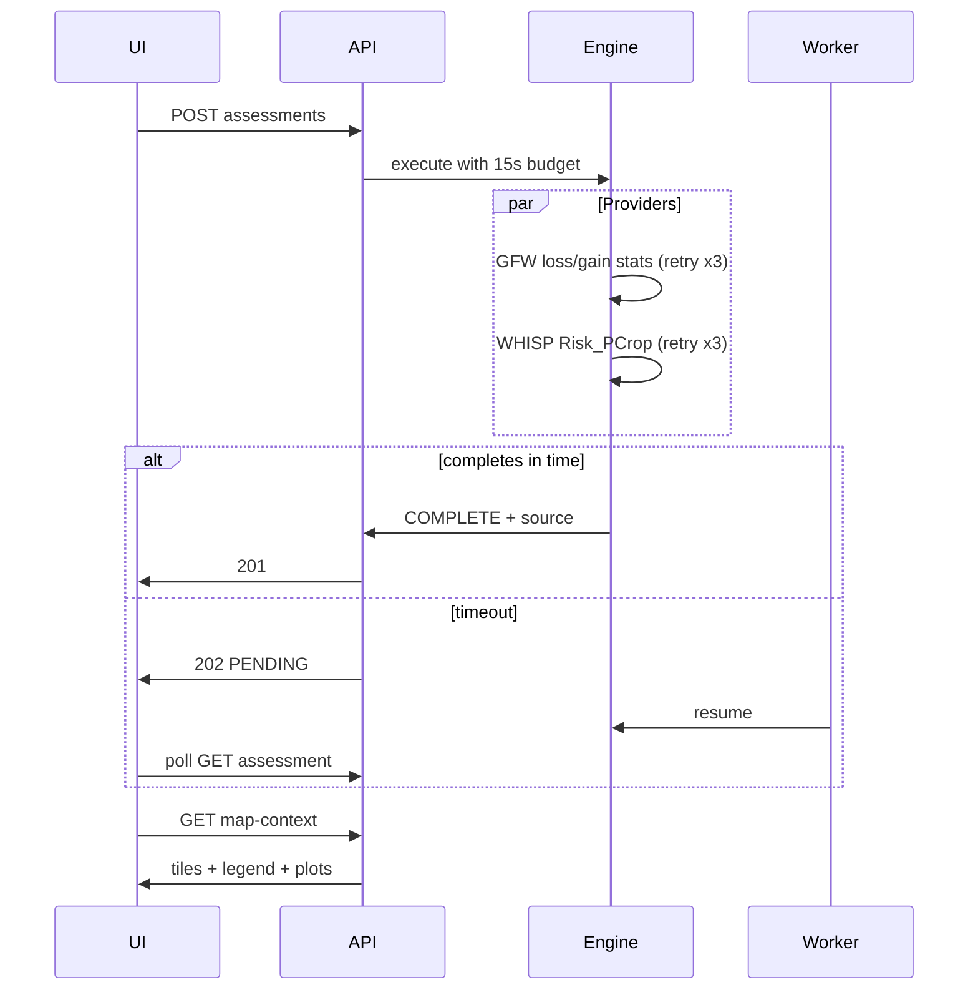

# Deforestation & Farm Assessment — Solution Design

> Status: **implemented** — PostgreSQL-backed boundaries and assessments at `/api/v1/farms/:id/boundary`, `/assessments`, `/assessments/:assessmentId/map-context`, `/land-cover-timeline`, `/geocode`; frontend BFF proxies when `NEXT_PUBLIC_USE_MOCK_API=false`.

## Introduction

Farm boundary persistence, WHISP/GFW-backed deforestation assessments, land-cover timelines, assessment map overlays, and supply-chain risk aggregation for the Traceability Platform POC. Primary persona: **import operator** (farm → customer) mapping Nigerian plots. Assessments run synchronously with a ~15s budget; slow provider calls fall back to an async worker polled by the client. Provider calls retry up to **3 times** before FAILED; the UI keeps the last COMPLETE assessment visible.

## Third-party APIs

| Provider                       | Purpose                                                   | Backend module      |
| ------------------------------ | --------------------------------------------------------- | ------------------- |
| **Open Foris WHISP (FAO)**     | EUDR cocoa plot risk (`Risk_PCrop`) + zonal stats         | `WhispClient`       |
| **Nominatim (OSM)**            | Nigeria-biased geocode / autocomplete (`countrycodes=ng`) | `NominatimClient`   |
| **GFW Data API**               | Tree cover loss/gain + forest cover within polygon        | `GfwClient`         |
| **GFW Tile Cache**             | Raster overlays on assessment map (frontend)              | Leaflet `TileLayer` |
| **WDPA / Protected Planet v4** | Protected-area overlap (disabled until token configured)  | `WdpaClient`        |
| **OpenStreetMap**              | Street basemap (free)                                     | Leaflet `TileLayer` |
| **Esri World Imagery**         | Satellite basemap (free tile endpoint)                    | Leaflet `TileLayer` |

When `WHISP_API_KEY` or `GFW_API_KEY` are unset, clients return deterministic **FALLBACK** metrics suitable for local dev and CI. WDPA is currently **skipped** in the assessment engine (PA fields zeroed). Assessment API responses include `source` so the UI can show **Live (WHISP + GFW)** vs **Demo fallback**.

## UI data sources

| UI widget                 | API / field                                                                  |
| ------------------------- | ---------------------------------------------------------------------------- |
| Full-screen farm map      | Leaflet (OSM/Esri) + `GET .../map-context` → `tileLayers`, `legend`, `plots` |
| Land-cover legend         | `map-context.legend` (loss / gain / stable / non-forest)                     |
| Metrics card + provenance | `assessment.analysis` + `assessment.source`                                  |
| Land-cover timeline chart | GFW `yearlyLoss` via land-cover points                                       |
| Boundary input            | `PUT .../boundary` — `plots` (multi) or `coordinates` (legacy)               |
| Locate (NG)               | `GET /geocode?q=&limit=` → `{ results[] }` + persist via farm PATCH          |

## Environment variables

| Variable                     | Default                          | Description                                        |
| ---------------------------- | -------------------------------- | -------------------------------------------------- |
| `WHISP_API_KEY`              | empty                            | Open Foris WHISP API key                           |
| `GFW_API_KEY`                | empty                            | Global Forest Watch Data API key                   |
| `WDPA_API_TOKEN`             | empty                            | Protected Planet API token                         |
| `PA_PROXIMITY_BUFFER_KM`     | `1`                              | Proximity buffer ring around farm for map context  |
| `WHISP_POLL_MS`              | `2000`                           | WHISP status poll interval                         |
| `WHISP_MAX_POLL_ATTEMPTS`    | `30`                             | WHISP poll attempts before fallback                |
| `NOMINATIM_USER_AGENT`       | `SupplyChainTraceabilityPOC/1.0` | Required User-Agent for Nominatim                  |
| `ASSESSMENT_SYNC_TIMEOUT_MS` | `15000`                          | Sync assessment budget before 202 async            |
| `ASSESSMENT_WORKER_ENABLED`  | `false`                          | Enable polling worker process (set `true` for POC) |
| `ASSESSMENT_WORKER_POLL_MS`  | `5000`                           | Worker poll interval                               |

Frontend: `NEXT_PUBLIC_USE_MOCK_API=false` (Leaflet map — no paid map token required).

## Data model

### `FarmBoundary`

- `farmId` (unique FK)
- `coordinates` JSON — legacy flat ring **or** `{ plots: GeoCoordinate[][] }` for multi-plot
- `areaHectares` (sum of plot areas, Turf geodesic)
- API returns `coordinates` (first plot) + `plots` (all rings)
- Limits: 1–20 plots, 3–500 vertices per plot

### `FarmAssessment`

- `riskLevel`, `analysis` JSON, `assessedAt`, `boundaryAreaHectares`
- `analysis` fields: `deforestationPercent`, `afforestationPercent`, `stabilityPercent`, `forestCoverPercent`, `protectedAreaOverlapPercent`, `protectedAreaDetected`, `whispRiskPcrop`
- `status`: `PENDING` | `RUNNING` | `COMPLETE` | `FAILED`
- `source`: `GFW_WDPA` | `WHISP_GFW_WDPA` | `FALLBACK` (**exposed in API**)
- `providerMetadata`: WHISP raw properties, GFW geostore id

### `FarmLandCoverPoint`

- Baseline yearly points (`BASELINE`) + assessment snapshot (`ASSESSMENT`)

## Endpoints

| Method   | Path                                                      | Response                                  |
| -------- | --------------------------------------------------------- | ----------------------------------------- |
| `GET`    | `/api/v1/farms/:id/boundary`                              | `{ boundary \| null }` (+ `plots`)        |
| `PUT`    | `/api/v1/farms/:id/boundary`                              | `FarmBoundary` (`coordinates` or `plots`) |
| `DELETE` | `/api/v1/farms/:id/boundary`                              | `{ success, farmId }`                     |
| `GET`    | `/api/v1/farms/:id/geocode`                               | `{ latitude, longitude, displayName }`    |
| `GET`    | `/api/v1/geocode?q=&limit=`                               | best match + `results[]` (NG-biased)      |
| `GET`    | `/api/v1/farms/:id/assessments`                           | `{ assessments[], total }` (+ `source`)   |
| `POST`   | `/api/v1/farms/:id/assessments`                           | `FarmAssessment` (201 or 202)             |
| `GET`    | `/api/v1/farms/:id/assessments/:assessmentId`             | `FarmAssessment`                          |
| `GET`    | `/api/v1/farms/:id/assessments/:assessmentId/map-context` | Tiles, legend, plots, bbox                |
| `GET`    | `/api/v1/farms/:id/land-cover-timeline`                   | `{ points[] }`                            |

## Assessment flow



1. Load saved boundary → GeoJSON Polygon or MultiPolygon
2. Parallel GFW + WHISP with up to 3 retries
3. Merge analysis metrics; derive `stabilityPercent`
4. `deriveRiskLevel()` — includes WHISP `Risk_PCrop`
5. Persist assessment + `source` + land-cover points; farm status → `ASSESSED`

## Risk wiring

`FarmAssessmentRepository.getLatestByFarmIds()` feeds:

- `SupplyChainService.loadSupplyChainReportContext()` — compact chain risk badges + PDF report
- `DashboardService` — at-risk chains KPI
- `BatchService.createBatch()` — optional assessment on mapped farms

Deep map UX stays on the farm **Deforestation** tab; chain/dashboard remain compact badges only.

## Frontend map UX

### Locate (Nigeria)

- Place / postcode search with autocomplete (`results[]`, `countrycodes=ng`)
- Paste lat/lng, browser GPS, pick-on-map
- Confirm → fly-to + **persist** farm lat/lng via farm PATCH
- Default map center: Nigeria

### Boundary map (full-screen)

- Primary surface: farm detail → Deforestation → **Open full-screen map**
- Input methods: Draw, Coordinates, GeoJSON; multi-plot support
- Locate → zoom → **auto satellite** while drawing → **street on save**
- Vertex drag after close; 3–500 vertices/plot; max 20 plots
- Assessment overlays hidden while drawing

### Assessment map

- Modes: **Satellite evidence** | **Risk layers**
- GFW loss/gain rasters clipped to boundary (mask outside plots)
- Legend: loss / gain / stable / non-forest (% + ha)
- Provenance badge; EUDR disclaimer + OSM/Esri/GFW/WHISP attribution
- WDPA overlays out of scope for this iteration

## Seed data

1. `seedFarmBoundariesIfEmpty` — Ashanti Cocoa Farm ~4.91 ha polygon
2. `seedFarmAssessmentsIfEmpty` — three COMPLETE MEDIUM assessments + baseline timeline

Seed order: commodities → actors → supply chains → farms → **boundaries** → batches → allocations → events → **assessments**

## Failure modes

| Scenario                         | Behaviour                                  |
| -------------------------------- | ------------------------------------------ |
| No boundary                      | 400 on POST assessment                     |
| Boundary delete with assessments | 400 blocked                                |
| WHISP/GFW timeout                | 202 + worker completes later               |
| Provider error after 3 retries   | FAILED; UI keeps last COMPLETE             |
| FALLBACK source                  | UI shows Demo fallback (not EUDR evidence) |
| Nominatim miss                   | 404 geocode                                |
| Incomplete assessment            | 400 on GET map-context                     |

## Worker

```bash
npm run worker:assessments
```

Polls `FarmAssessment WHERE status IN (PENDING, RUNNING)` when `ASSESSMENT_WORKER_ENABLED=true`.

## Out of scope

- EUDR legal certification APIs (WHISP provides risk evidence only)
- PostGIS polygon storage
- WDPA / protected-area overlays (until token)
- Edit-farm boundary wizard step
- Mobile drawing
- KML / shapefile / GPX
- Manual `UNDER_REVIEW` / `APPROVED` workflow UI
